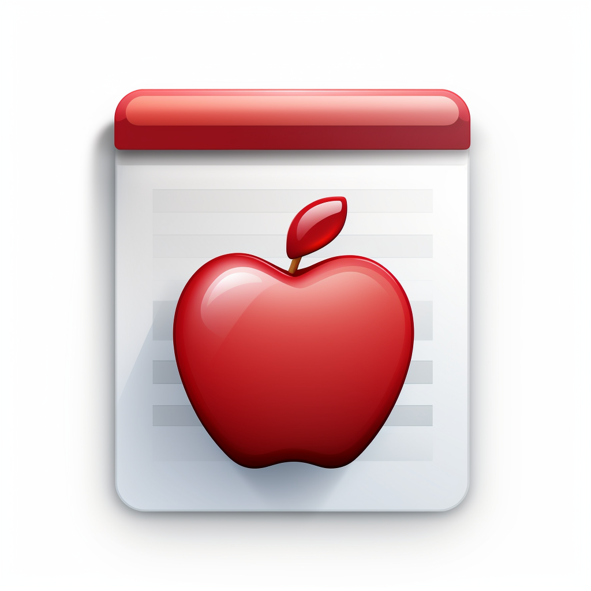

# Todo List Swift

Well, as you might have already figured out from how basic this app is compared to what I usually work on every day, not to mention the fact that it's written in a language that hasn't been on my GitHub until now, I'm actually learning Swift. Why Swift, you might wonder? If you stick around long enough, you'll eventually find out. But for the time being, you'll have to be satisfied with looking at the cool icon I've designed for this app.

## Cool app icon

